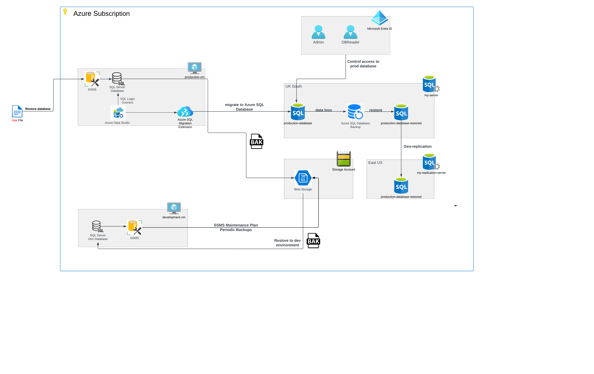

# Azure Database Migration

## Overview
This project aims to architect and implement a cloud-based database system on Microsoft Azure, showcasing expertise in cloud engineering. The primary objectives include establishing a production environment database, migrating it to Azure SQL Database, simulating disaster recovery scenarios, implementing security measures, and setting up a Windows Virtual Machine (VM) to serve as the cornerstone of the production environment.

## Usage
This project deployed two Azure VMs, one for development and one for production, both running Windows 11 Pro. Ensuring ample CPU and memory (Standard D2s v3) was crucial for smooth remote desktop access. The aim was to showcase hands-on experience in Azure Database Migration.

## Milestone 1 - Setting up the Environment
### 1. Set up a github repo
Using VS Code, a GitHub repository was created to manage updates and track changes seamlessly. You can find the repository at: https://github.com/Federal2JZ/azure-database-migration114

### 2. Azure Credentials
Azure account credentials were generated by AiCore support to grant access to my Azure portal.

## Milestone 2 - Setting up the Production Environment
### 1. Provisioning a Windows Virtual Machine (VM)
- **Operating System:** Windows 11 Pro
  - Windows 11 Pro is chosen as the operating system for the virtual machine to leverage its advanced features and security enhancements.
- **Virtual Machine Configuration:**
  - Select appropriate VM size and specifications based on workload requirements and budget constraints.
  - Configure disk size, CPU, memory, and other resources to meet performance needs (Standard D2s v3 (2 vCPUs, 8 GiB memory)).
  - Place the virtual machine within a newly created dedicated resource group for better organization.
- **Network Configuration:**
  - Configure virtual networking settings to establish connectivity between the VM and other resources in the Azure environment.
  - Implement firewall rules to control incoming and outgoing traffic, ensuring network security.
- **Remote Desktop Protocol (RDP) Access:**
  - Enable RDP access to the VM to allow remote management and configuration.
  - Set up secure RDP authentication mechanisms to prevent unauthorized access.

### 2. Establishing Remote Connection
- Establish a secure connection to the provisioned VM using the RDP protocol and Microsoft Remote Desktop Connection on a local Windows machine.
- Obtain direct access to the VM's operating system for efficient management and configuration.

### 3. Installing SQL Server and SQL Server Management Studio (SSMS)
- Install [SQL Server](https://www.microsoft.com/en-us/sql-server/sql-server-downloads) and [SSMS](https://learn.microsoft.com/en-us/sql/ssms/download-sql-server-management-studio-ssms?view=sql-server-ver16) on the VM to facilitate proficient database management within the production environment.
- Configure SQL Server to ensure optimal performance and security.

### 4. Creating the Production Database
- Restore the AdventureWorks database from the [backup file](https://aicore-portal-public-prod-307050600709.s3.eu-west-1.amazonaws.com/project-files/93dd5a0c-212d-48eb-ad51-df521a9b4e9c/AdventureWorks2022.bak) onto the SQL Server instance on the VM.
- The AdventureWorks database is successfully restored, containing tables, views, stored procedures, and data, emulating a fictional manufacturing company's operations.

## Milestone 3 - Migrating to Azure SQL Database
### 1. Setting Up Azure SQL Database
- Create an Azure SQL Database to serve as the target for migrating the on-premise database.
- Configure SQL login as the chosen authentication method for the associated SQL Server.
- Verify that the SQL Server has appropriate firewall rules, including adding the IP address of the VM to the firewall settings.

### 2. Preparing for Migration
- Install and configure Azure Data Studio on the production Windows VM to facilitate database management and migration tasks.

### 3. Connecting to Azure SQL Database
- Use Azure Data Studio to establish a connection to the newly created Azure SQL Database, enabling communication between the on-premise and cloud databases.

### 4. Schema Migration
- Install the SQL Server Schema Compare extension within Azure Data Studio.
- Leverage the extension to compare and migrate the schema from the on-premise database to the Azure SQL Database.

### 5. Data Migration
- Install the Azure SQL Migration extension within Azure Data Studio to facilitate the smooth transfer of data from the on-premise database to the Azure SQL Database.

### 6. Validating Migration Success
- Conduct some validation to ensure the success of the database migration process, such as running an sql script.
- Inspect the migrated database's data, schema, and configurations to confirm adherence to principles of data integrity and successful execution of the migration.

## Milestone 4 - Data Backup and Restore
### 1. Backup the On-Premise Database
- Generate a full backup of the production database hosted on the Windows VM. This backup essentially duplicates the database, providing a safety net in the event of unforeseen issues.
- Once the backup is complete, store the resultant backup file in a designated location on the VM or local machine for easy access and redundancy.

### 2. Upload Backup to Blob Storage
- Configure an Azure Blob Storage account, which serves as a secure online repository for your database backups.
- Next, upload the previously created database backup file to the Blob Storage container. This step provides an extra layer of backup protection through the presence of a redundant copy stored remotely.

### 3. Restore Database on Development Environment
- To replicate a development environment, provision a new Windows VM that mirrors the development setup. Install SQL Server on this VM to mimic the database infrastructure.
- Subsequently, proceed to restore the database backup onto this new "sandbox" environment. This allows us to safely explore and experiment with new concepts, while the main production data remains unaffected.

### 4. Automate Backups for Development Database
- On the development Windows VM, utilize SSMS to establish a Management Task that automates regular backups of your development database.
- Configure a weekly backup schedule to ensure consistent protection for the evolving work and simplify recovery for the development environment if needed.

## Milestone 5 - Disaster Recovery Simulation
### 1: Simulating Data Loss and Validation
 **Simulate Data Loss:**
   - Deliberately remove critical data from your production database to replicate a scenario where data integrity is compromised.
   - Choose which data to remove, ensuring that it affects the integrity of the database.
   - Document the simulated data loss meticulously to serve as a blueprint for recovery testing.
   ```sql
   -- Simulate data loss by deleting and corrupting critical data from a table
   DELETE TOP (100)
   FROM dbo.DatabaseLog;

   UPDATE TOP (100) dbo.DatabaseLog
   SET SCHEMA = NULL   
   ```

**Confirm Simulation Success:**
   - After completing the simulation, examine the Azure SQL Database using the connection already established in Azure Data Studio.
   - Verify that the critical data has been successfully removed and that the database reflects the simulated data loss.
   ```sql
   -- Check if the data has been successfully deleted
   SELECT * FROM dbo.DataBaseLog;
   -- Verify that the above query has deleted 100 rows and changed 100 rows to NULL
   ```

### 2: Database Restoration and Validation
**Database Restoration:**
   - Use Azure SQL Database Backup to restore the production database to a point just before the simulated data loss occurred.
   - Access the Azure portal and navigate to the Azure SQL Database service.
   - Choose the appropriate backup file and initiate the restoration process.

**Validate Restoration Success:**
   - After the restoration process completes, examine the restored data through the connection in Azure Data Studio.
   - Confirm that the critical data has been restored and that the database is functioning correctly.
   - Note that the restored database will now function as your production database, given that the previous production database lacks critical data.

**Cleanup:**
   - Once the production database has been successfully restored from a backup, delete the database that suffered data loss in the Azure portal.
   - Ensure that the cleanup process is carried out accurately to avoid any unintended consequences.

## Milestone 6 - Geo Replication and Failover
### 1: Setting up Geo-Replication
**Configure Geo-Replication:**
   - Begin by setting up geo-replication for the production Azure SQL Database.
   - Access the Azure portal and navigate to the Azure SQL Database service.
   - Select the primary database and locate the option to configure geo-replication.
   - Follow the prompts to create a synchronized replica of the primary database on a separate SQL server located in a different geographical region from your primary database server.

**Geographical Separation Importance:**
   - Understand that geographical separation is crucial as it bolsters redundancy and resilience, minimizing shared risks.
   - Choose a secondary region strategically to ensure optimal disaster recovery capabilities and compliance with regulatory requirements.

### 2: Orchestrating a Planned Failover
**Simulate Real-World Challenges:**
   - Orchestrate a planned failover to the secondary region to simulate real-world challenges.
   - Access the Azure portal and navigate to the Azure SQL Database service.
   - Initiate the failover process, which transitions operations to the secondary copy.
   - Monitor the failover process closely to evaluate the availability and data consistency of the failover database.

**Failback Process:**
   - After evaluating the failover database's availability and data consistency, perform a failback to the primary region.
   - Access the Azure portal and navigate to the Azure SQL Database service.
   - Initiate the failback process to transition operations back to the primary database.
   - Monitor the failback process closely to ensure a seamless transition and to demonstrate the cyclical nature of your failover strategy.

## Milestone 7 - Microsoft Entra Directory Integration
### 1: Enabling Microsoft Entra ID Authentication
**Configure Microsoft Entra ID Authentication:**
   - Begin by enabling Microsoft Entra ID authentication for the SQL Server that hosts your Azure SQL production database.
   - Access the Azure portal and navigate to the Azure SQL Database service.
   - Choose the SQL Server hosting your production database and locate the option to configure authentication settings.
   - Integrate Microsoft Entra ID as a trusted identity provider, allowing users to authenticate using their Microsoft Entra credentials.

**Assign Microsoft Entra Admin:**
   - Subsequently, choose a Microsoft Entra admin who holds privileged permissions within the Azure SQL Database environment.
   - This admin will have authority over user management and access control.
   - Ensure that the chosen admin has sufficient permissions to manage users and roles within the Azure SQL Database environment.
   - Verify that you can establish a connection to the production database using Microsoft Entra credentials within Azure Data Studio.

### 2: Creating and Assigning Database User
**Generate DB Reader User in Microsoft Entra ID:**
   - Begin by generating a new user account in Microsoft Entra ID, which will serve as your DB Reader user.
   - Ensure that the user account is created with appropriate permissions and follows organizational policies regarding access control.

**Assign db_datareader Role:**
   - In Azure Data Studio, ensure that you're connected to the production database using the Microsoft Entra admin credentials.
   - Proceed to assign the db_datareader role to the previously created DB Reader User.
   - This role provides the user with read-only privileges to the production database.
```sql
   -- Creating and assigning database user with read-only access
   CREATE USER [DB_Reader@yourdomain.com] FROM EXTERNAL PROVIDER;
   ALTER ROLE db_datareader ADD MEMBER [DB_Reader@yourdomain.com];
```

**Testing Permissions:**
   - Reconnect to the production database using Azure Data Studio and the credentials of the new DB Reader AD user.
   - Test out the permissions of the user to ensure the correct role has been assigned to this user.
   - Verify that the DB Reader user can access the database and perform read-only operations as expected.

   
## Database Migration Diagram Schema



## License
Accessed via the AiCore programme.

The author of the work is Darpan Vinodrai.